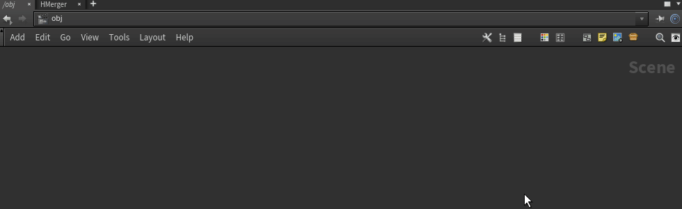
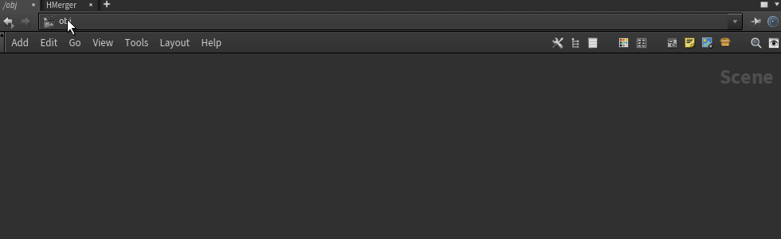
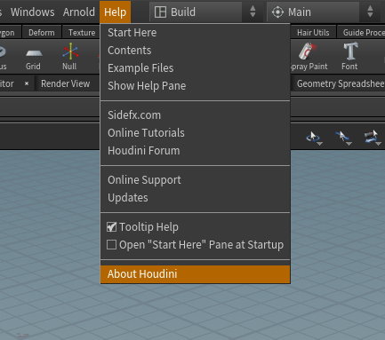
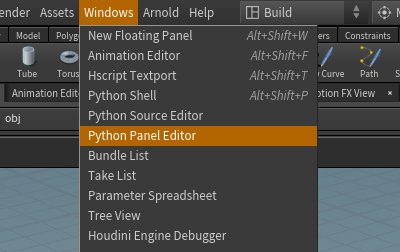
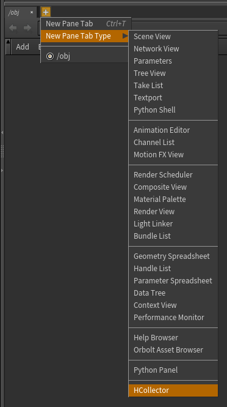
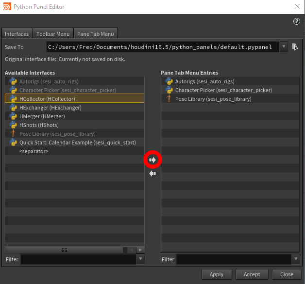

# HMerger

Houdini python panel tool for batch merge geometry from parent directory

- Batch merge files from parent folder
- Detect file sequenses								

  
  
- Batch convert files to obj 

  

How to Install:

1. Choose proper Qt version corresponding to your Houdini build.
  
  To find which version do you use go to Help > About
  
  
  
  
2. Copy 'python_panels' and 'scripts' foldiers from 'QTx' folder into your Houdini settings folder %USERPROFILE%\Documents\houdiniXX.X

3. Inside Houdini go to the Windows > Python Panel Editor

  

4. On 'Pane Tab Menu' choose the tool on the left panel and click the right arrow to transfer it to the right panel. 

  

5. Hit accept

6. Now it is available in the 'New Pane Tab Type Menu'.

  
